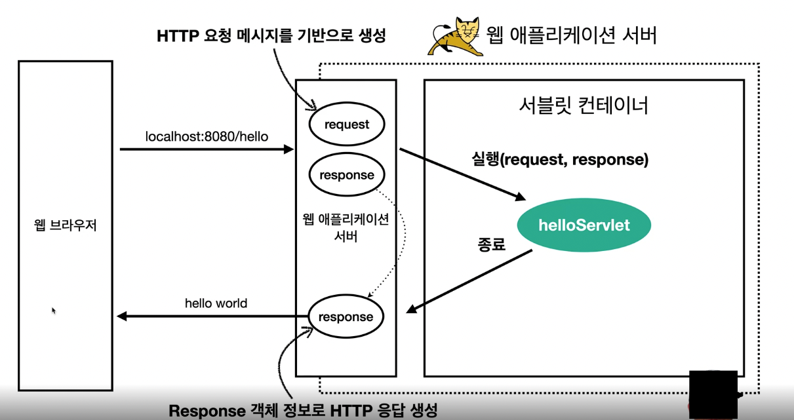

# all of spring
## webserver
- http 기반으로 동작
- 정적 리소스 제공, 기타 부가기능
- 정적 html, css, js이밎, 영상
- nginx, apache

## WAS ( wep aaplication server)
- http기반으로 동작
- 웹 서버 기능 포함 + 정적 리소스 제공 가능
- 코드를 실행해서 애플리케이션 로직 수행
  - 동적 html, http api(json)
  - 서블릿, jsp  스프링 mvc
- 톰캣, jetty, undertow가 있음

## 웹서버, WAS 차이 
- 웹서버는 정적리소스, WAS는 애플리케이션 로직
- 둘의 요어도 경계도 모호함
  - 웹서버도 프로그램을 실행하는 기능을 포함하기도함
  - WAS도 웹서버 기능을 제공함
- 자바는 서블린 컨테이너 기능을 제공하면 WAS( 서블릿 없이 자바 코들르 실행하는 서버 프레임워크도 있음)
- WAS는 애플리케이션 코들르 실행하는데 더 특화 되어 있다.

## 웹 시스템 구성하는방법
Client -> WebServer -> WAS -> DB 를 연결하여 구성한다
- WebServer는 정적리소스( HTML, CSS, JS, image)fmf cjflgkrh
- 웹서버는 애플리케이션 로직같은 동적인 처리가 필요하면 WAS에 요청을 위임한다. 
- WAS는 중요한 애플리케이션 로직을 전담하여 처리한다

이렇게 하면 효율적인 리소스 관리리가 가능하다 
- 정적 리소스가 많이 사용되면 웹서버만 늘리는등 할 수 있다. 
- 정적 리소스만 제공하는 웹 서버는 잘 죽지 않는다. 
- 애플리케이션 로직이 동작하는 WAS 서버는 잘 죽음
- WAS, DB장애시 WebServer서버가 오류화면을 제공할 수 있다. 

## Servlet
```java
@WebServlet(name = "helloServlet", urlPatterns = "/hello")
public class HelloServlet extends HttpServlet{
    @Override
  protected void service(httpServletRequest request, HttpServletResponse response ){
        //application logic
    }
}

```
- urlPatterns()의 url이 호출되면 서블릿코드 실행
- HTTP 요청정보를 편리하게 사용할 수 있는 HttpServletRequest
- HTTP 응답 정보를 편리하게 제공할 수 있는 HttpServletResponse
- 개발자는 HTTP 스펙을 매우 편리하게 사용

### Servlet 응답 체계
웹 브라우저에서 url 호출
-> WAS에서 http요청 메시지를 기반으로 request, response 객체 생성
-> 서블릿 컨테이너를 오출하여 해당하는 url을가진 servlet 실행
-> 종료 후 생성된 response객체에 결과를 담아서 웹브라우저에게 리턴


서블릿 컨테이너란?
was안에 존재gksek
- 톰캣처럼 서블릿을 지원하는 WAS를 서블릿 컨테이너라함
- 서블릿 컨테이너는 객체를 생성, 초기화, 호출, 종료하는 생명주기 관리
- 서블릿 객체는 싱글톤으로 관리
  - 고객의 요청이 올때 마다 계속 ㅐㄱ체를 생성하는것은 비효율적임
  - 최초 로딩 시점에 서블릿객체를 미리 만들어두고 재활용
  - 모든 고객 요청은 동일한 서블릿 객체 인스턴스에 접근
  - 공유변수 사용주의 
  - 서블릿 컨테이너 종료시 함께 종료
- JSP도 서블릿으로 변환되어 사용
- 동시 요청을 위한 멀티쓰레드 처리 지원
---
## 멀티쓰레드
백엔드 개발자에게 굉장히 중용한 개념이다. 학부때도 멀티 프로세스, 멀티 쓰레드에 관해서 배웠지만 실무에서 사용할 일이 없었다. 
이게 왜 필요하냐면 http요청이 들어왔을때 서블릿컨테이너의 싱글톤 객체로 생성된 servlet객체는 누가 호출하는 것일까? `바로 쓰레드`이다.

### 쓰레드 
- 애프릴케이션 코드를 하나하나 순차적으로 실행하는 것은 쓰레드
- 자바 메인 메서드를 처음 실행하면 main이라는 이름의 쓰레드 실행
- 쓰레드가 없다면 자바 애플리케이션 실행 불가능
- 쓰레드는 한번에 하나의 코드 라인만 수행
- 동시처리가 필요하면 추가 쓰레드 생성 필요
- 
### 쓰레드 풀
요청마다 쓰레드 생성의 단점 보안

특징 
- 필요한 쓰레드를 쓰레드 풀에 보관하고 관리.
- 쓰레드 풀에 생성 가능한 쓰레드의 최대치르 ㄹ관리, 톰캣은 최대 200개 기본ㅇ설정

사용
- 쓰레드가 필요하면, 이미 생ㅅ어되어 있는 쓰레드를 쓰레드 풀에서 꺼내서 사용한다. 
- 사용을 종료하면 쓰레드 풀에 해당 쓰레드 반납
- 최대 쓰레드가 모두 사용중이어서 쓰레드 풀에 쓰레드가 없으면?
  - 기다리는 요청은 거절하거나 특정 숫자만큼만 대기하도록 설정 가능
장점
- 쓰레드가 미리 생성ㄷ외어 쓰레드를 생성하고, 종료비용 절약, 응답 시간 빠름 
- 생성 가능한 쓰레드의 최대치가 있으므로 너무 많은 요청이 들어와도 기존 요청은 안전한게 처리가능

WAS의 주요 튜닝 포인트는 최대 쓰레드 수이다. 
이값을 낮게 설정하여 동시욫어이 많으면 클라이언트는 응답지영이 발생하고 값이 높으면 cpu, 임계첨 초과로 서버가 다운된다.

## 스프링부트를 이용한 서버구축
현재 물리서버를 구축해야될 일이생겨 도커를 공부중인데 강의에 스프링부트관련된내용이 나와 정리
스프링부트는 tomcat이라고하는 서버를 내장
과거에는 서버에 was를 직접 설치하고 소스는 war파일을 만들어서 철치한 was에 배포
스프링부트는 빌드결과(jar)에 was서버 포함-> 빌드 배포 단순화 할 수 있다. 
